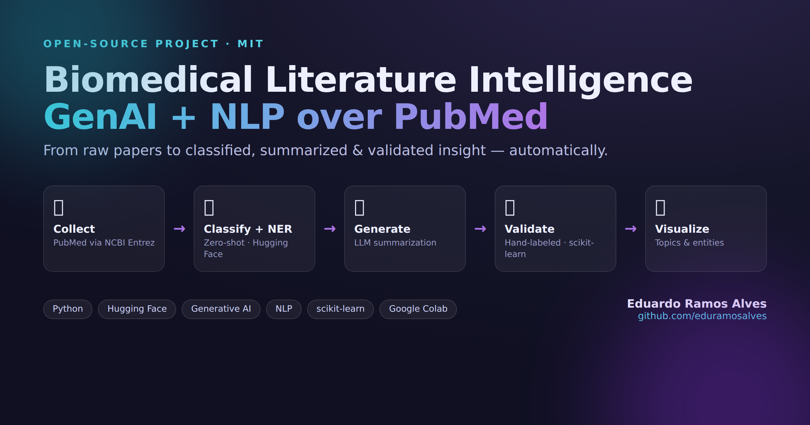

# Biomedical Literature Intelligence — GenAI + NLP over PubMed

An end-to-end notebook that collects real biomedical literature and applies modern NLP and Generative AI to it. The domain is arbovirus surveillance (Dengue, Zika, Chikungunya) — the area I researched as a CNPq scholar.

**[▶ Open in Google Colab](https://colab.research.google.com/github/eduramosalves/genai-biomedical-nlp/blob/main/biomedical_genai_nlp.ipynb)**

 

## What it does

| Step | Technique | Tools |
|------|-----------|-------|
| Collect | PubMed abstract retrieval | Biopython / NCBI Entrez API |
| Classify | Zero-shot topic classification (no training data) | Hugging Face `facebook/bart-large-mnli` |
| Extract | Biomedical named-entity recognition | Hugging Face `d4data/biomedical-ner-all` |
| Generate | Abstractive summarization + LLM synthesis | Hugging Face `distilbart`, optional OpenAI `gpt-4o-mini` |
| Validate | Hand-labeled holdout + accuracy / F1 | Scikit-Learn |
| Visualize | Topic distribution + top entities + entity types | Matplotlib |

## Skills demonstrated

Python · Hugging Face `transformers` · Generative AI / LLMs · NLP (zero-shot classification, NER, summarization) · model validation · data collection · Pandas · Scikit-Learn · Matplotlib · runs on Google Colab (free tier).

## How to run

1. Open the notebook in Google Colab (button above) or locally with Jupyter.
2. On Colab: Runtime → Change runtime type → **GPU** (optional, faster).
3. Run all cells top to bottom. No paid API key required — the OpenAI cell skips itself if no key is set.

## Notes

- Validation is a deliberate two-step exercise, not an auto-generated number. **Step 1** prints a deterministic held-out sample (15 abstracts) with the model's prediction; **Step 2** holds a `GROUND_TRUTH` dict keyed by PMID. Read each abstract, fill in your own labels, then re-run Step 2 for accuracy + per-class F1. Labels are keyed by PMID (not row order), so the score stays correct even though PubMed's relevance ordering shifts between runs. Until you label some, Step 2 honestly reports that none are labeled rather than printing a fake metric.
- NCBI Entrez requires an email (already set in the notebook). Be polite with request volume.
